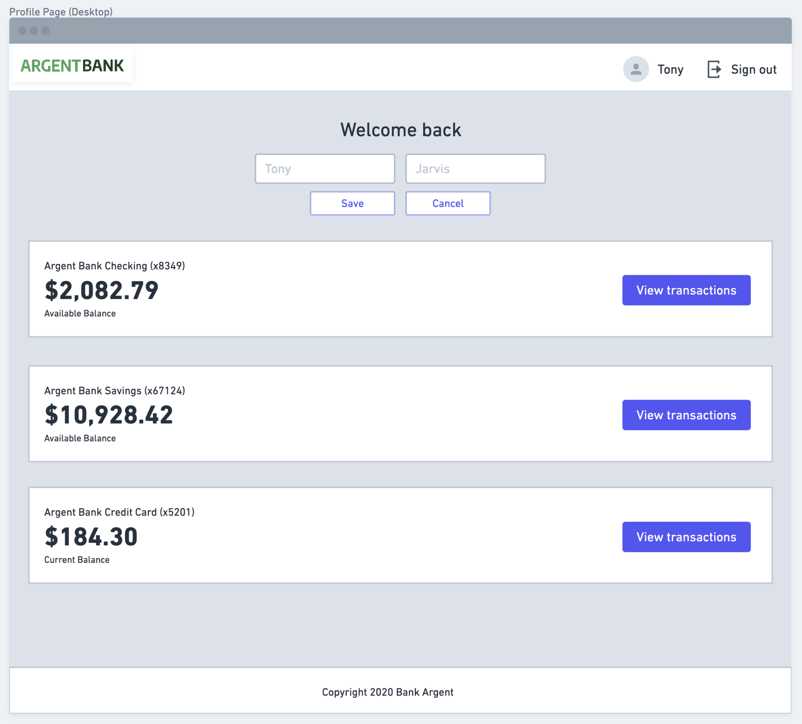

# 💰 Argent Bank

Argent Bank is a React project that uses Redux. The goal of this project is to create a strong, reliable and persistent authentication system that interacts with a back-end.
More simply, it is a bank account management application, where the user can consult his information and modify it.

## Prerequisites

- [NodeJS](https://nodejs.org/en/)
- [npm](https://www.npmjs.com/)
- [MongoDB](https://www.mongodb.com/fr-fr)

## Technologies

This project is developed with:

- [React 18.1.0](https://fr.reactjs.org/)
- [React Router 6.3.0](https://reactrouter.com/)
- [React Redux 8.0.2](https://reactrouter.com/)
- [Redux Toolkit 1.8.3](https://redux-toolkit.js.org/)
- [Redux Persist 6.0.0](https://reactrouter.com/)
- [Proptypes 15.8.1](https://www.npmjs.com/package/prop-types)

## Installation

Clone the repository

```sh
git clone https://github.com/leolegrand/LeoLegrand_13_02062022
```

Install the dependencies/npm packages

```sh
npm install
```

Run the project

```sh
npm start
```

> By default the server is hosted on http://localhost:3000

## 🔗 Back-end / API

https://github.com/OpenClassrooms-Student-Center/Project-10-Bank-API

> This project works with a back-end service; to install it please follow the instructions that you will find by following this link.
